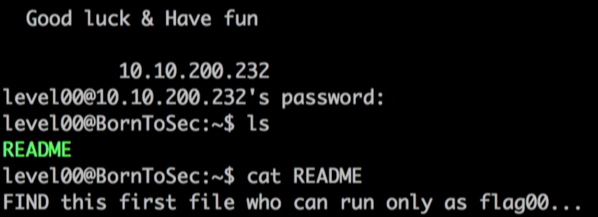

# level00

Watch the intra's video about snowcrash: \
There is a Readme that says:


So I looked for "linux find file with specific permission", \
Then I did "man find" and wrote this cmd:
```
find / -user flag00 2>/dev/null
# Output: /usr/sbin/john

cat /usr/sbin/john
# Output: cdiiddwpgswtgt
```

It wasn't working for `su flag00` so I thought it was encrypted, thus I went to [Dcode](https://www.dcode.fr/caesar-cipher) \
The brutforce gave me:
```
🠞15 (🠜11) | nottoohardhere
```
And it worked :)
